# 📝 App To Note

Flutter + Supabase ile geliştirilmiş, **offline-first**, **tam senkronize** bir not alma uygulaması.  
Modern, üretim seviyesinde bir mimaride; Flutter’ın UI gücü ile Supabase’in bulut tabanlı Postgres altyapısını birleştiren gerçek bir **full-stack mobil uygulamadır**.

---

## 🚀 Genel Özellikler

### 📝 Not Yönetimi

- Not oluşturma, düzenleme, silme
- Not sabitleme / sabitli notları filtreleme
- Silinen notları Çöp Kutusu’na taşıma
- Çöp kutusundan geri yükleme veya kalıcı silme

### 🔍 Arama & Filtreleme

- Uygulama içi hızlı arama (SearchDelegate)
- AI destekli arama & öneri entegrasyonu (başlık bazlı filtre)
- “Aramayı Temizle” için tek dokunuşlu AppBar ikonu

### 📡 Offline-First Mimari

- İnternet yokken bile not ekleme/düzenleme çalışır
- Tüm değişiklikler **Offline Queue** içinde saklanır
- Bağlantı geldiğinde Supabase’e otomatik senkron
- Senkron tamamlanınca kullanıcıya bildirim

### 🎨 Modern UI / UX

- Yumuşak degrade arkaplanlar
- iOS + Android uyumlu AppBar tasarımı
- “Menü” açılır liste (AI ile ara, notlarda ara, sabitleme filtresi, çöp kutusu)
- Liquid Pull To Refresh
- Multi-select ile toplu silme
- Tooltip destekli küçük ikon tasarımı

### 🛡️ Backend & Güvenlik

- Supabase Postgres üzerinde not tablosu
- Kullanıcı doğrulama (Supabase Auth)
- Row Level Security (RLS) ile sadece kendi notlarını görme yetkisi

---

## 📁 Proje Yapısı (Özet)

```text
lib/
  domain/
    models/note.dart
  data/
    repositories/notes_repository.dart
  presentation/
    cubits/
      notes/
      offline/
      auth/
    pages/
      notes/
      trash/
    widgets/sync_indicator.dart
  main.dart

⚙️ Kurulum & Çalıştırma (Kısa ve Net)

1️⃣ Repoyu Klonla
git clone https://github.com/<kendi-hesabın>/app_to_note.git
cd app_to_note

2️⃣ Paket Kurulumu (pub get)
Uygulama Flutter 3.x ile test edilmiştir.
flutter pub get

3️⃣ Supabase Yapılandırması (Kısa Özet)

✔️ Supabase Projesi Oluştur
https://supabase.com üzerinden yeni bir proje aç.

✔️ Database Tablosu

create table notes (
  id uuid primary key default uuid_generate_v4(),
  user_id uuid not null,
  title text not null,
  content text,
  pinned boolean default false,
  created_at timestamp default now(),
  updated_at timestamp default now()
);

✔️ RLS Policy

alter table notes enable row level security;
create policy "Users manage only their notes"
on notes for all
using (auth.uid() = user_id)
with check (auth.uid() = user_id);

✔️ Flutter İçin .env dosyası ekle

SUPABASE_URL=https://xxxx.supabase.co
SUPABASE_ANON_KEY=xxxx

4️⃣ Uygulamayı Çalıştır

flutter run
Cihazı seç → uygulama hazır 🎉

```

📸 Ekran Görüntüleri

## Kayıt Ol-Giriş Yap

<p float="left">
  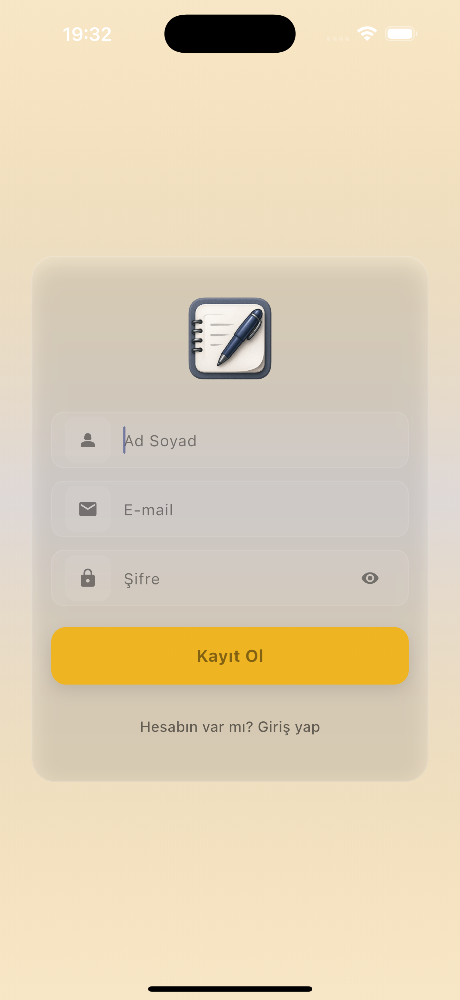
  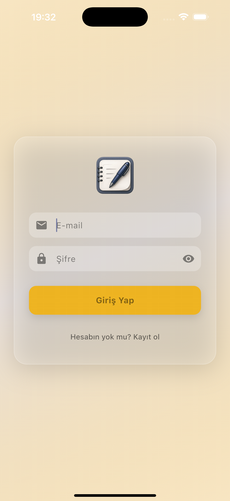
</p>

## Not Sayfası (Ana Sayfa)

<p float="left">
  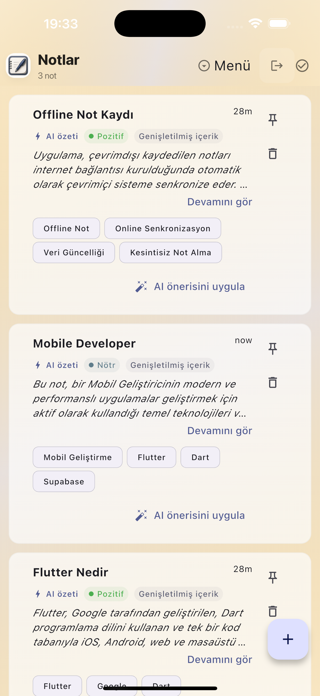
  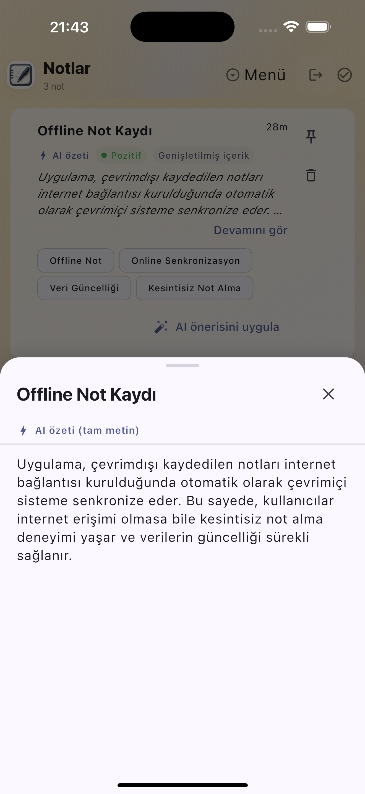
  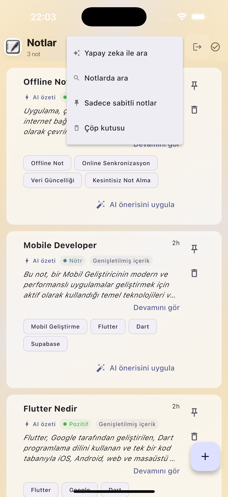
  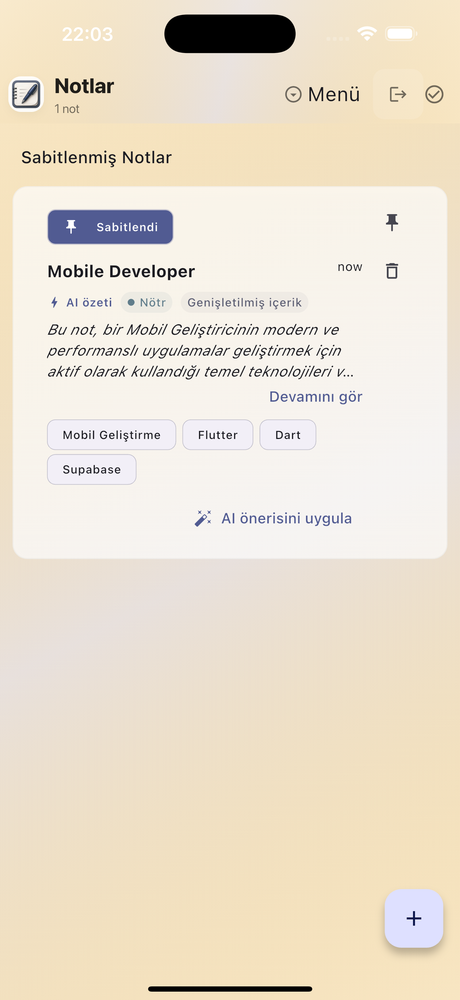
</p>

## Not Oluştur-Not Düzenle

<p float="left">
  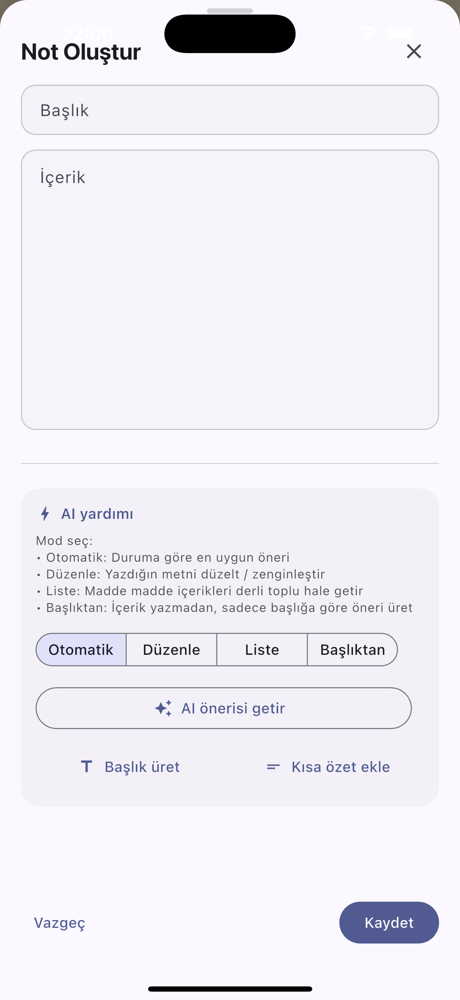
  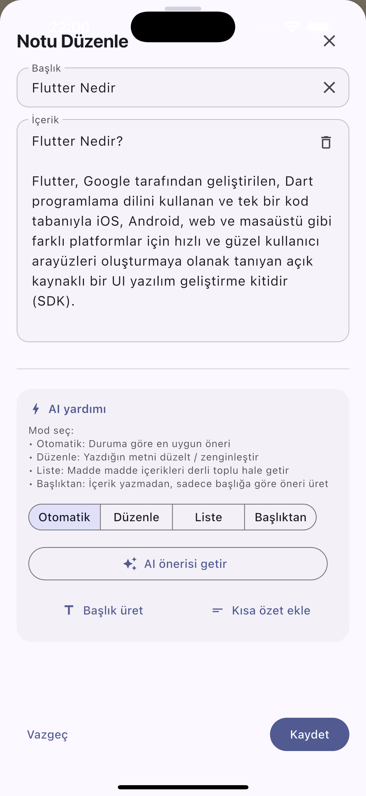
</p>

## AI Arama Ekranı-Arama Ekranı

<p float="left">
  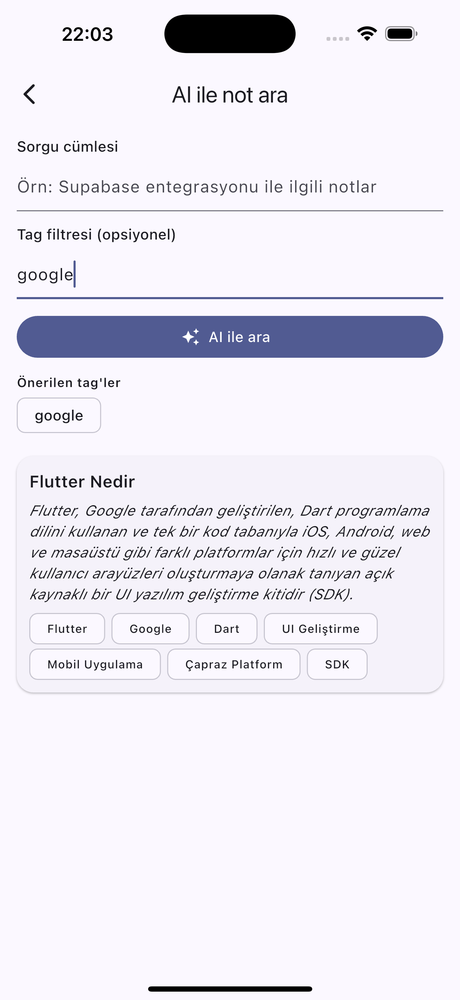
  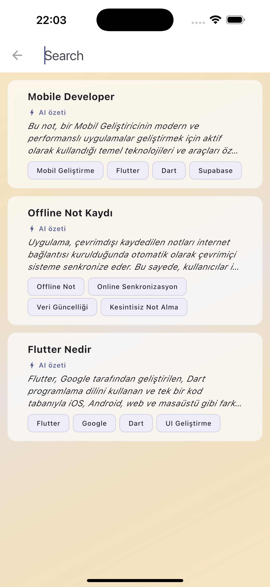
</p>

## Çöp Kutusu-Silinen Notlar

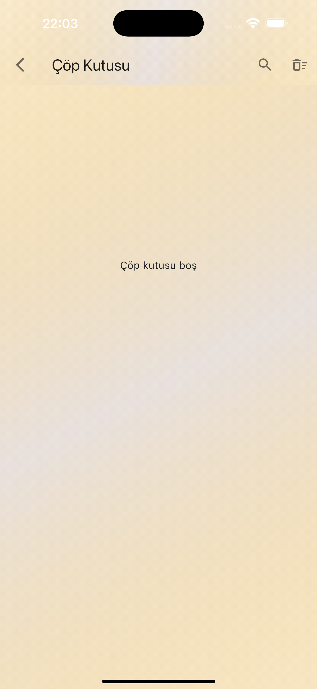

## Çevrimdışı-Çevrimiçi Durumları

<p float="left">
  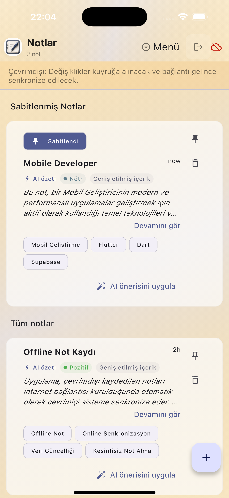
  
</p>

-----------------------------------------------------------------------------

## ⚡ Supabase Edge Functions (Deno)

Aşağıdaki bölümler tıklanarak açılır–kapanır yapıdadır.
Supabase üzerindeki AI fonksiyonlarını projene nasıl ekleyip çalıştıracağını özetler.

<details> <summary><strong>1️⃣ Supabase CLI Kurulumu</strong></summary>

Supabase Edge Functions geliştirmek için CLI gereklidir.

macOS:

brew install supabase/tap/supabase


Windows (scoop):

scoop install supabase


Kurulumu doğrula:

supabase --version

</details>
<details> <summary><strong>2️⃣ Supabase Projene Giriş Yap</strong></summary>

Terminalde giriş yap:

supabase login


Supabase Dashboard → Project Settings → Access Tokens kısmından token’ı alıp gir.

</details>
<details> <summary><strong>3️⃣ Edge Function Oluşturma</strong></summary>

Yeni bir fonksiyon oluşturmak için:

supabase functions new ai-embed-text


Bu komut otomatik olarak şu yapıyı oluşturur:

supabase/functions/ai-embed-text/
  index.ts


Örnek minimal handler:

import { serve } from "https://deno.land/std@0.131.0/http/server.ts";

serve(async (req) => {
  const { text } = await req.json();
  return new Response(
    JSON.stringify({ embedded: `Processed: ${text}` }),
    { headers: { "Content-Type": "application/json" } },
  );
});

</details>
<details> <summary><strong>4️⃣ Edge Function’ı Lokal Olarak Çalıştırma</strong></summary>

Test için:

supabase functions serve ai-embed-text


Fonksiyon şu adreste yayında olur:

http://localhost:54321/functions/v1/ai-embed-text


Test isteği:

curl -X POST \
  -H "Content-Type: application/json" \
  -d '{"text":"Merhaba dünya"}' \
  http://localhost:54321/functions/v1/ai-embed-text

</details>
<details> <summary><strong>5️⃣ Production’a Deploy Et</strong></summary>
supabase functions deploy ai-embed-text


Deploy sonrası URL:

https://<project-id>.supabase.co/functions/v1/ai-embed-text


Flutter’dan çağırmak için:

final resp = await http.post(
  Uri.parse('$SUPABASE_URL/functions/v1/ai-embed-text'),
  headers: {
    'Authorization': 'Bearer $SUPABASE_ANON_KEY',
    'Content-Type': 'application/json',
  },
  body: jsonEncode({'text': 'Hello'}),
);

</details>
<details> <summary><strong>6️⃣ TL;DR (Hızlı Özet)</strong></summary>

✔️ CLI yükle
✔️ supabase login
✔️ functions new <name>
✔️ Lokal test: supabase functions serve
✔️ Deploy: supabase functions deploy
✔️ Flutter → HTTP POST ile fonksiyona bağlan

</details>